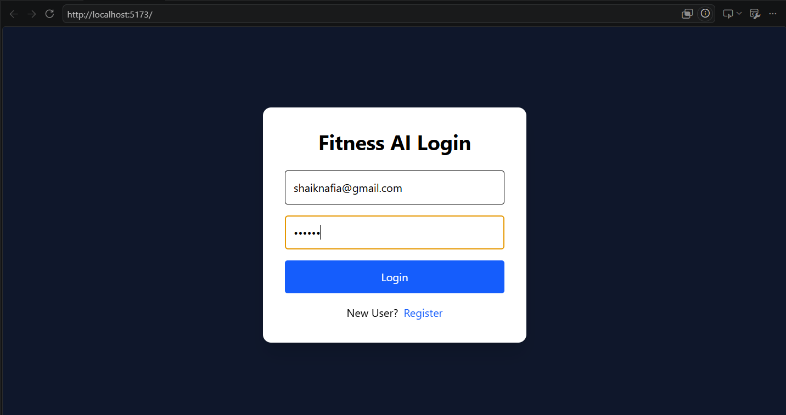
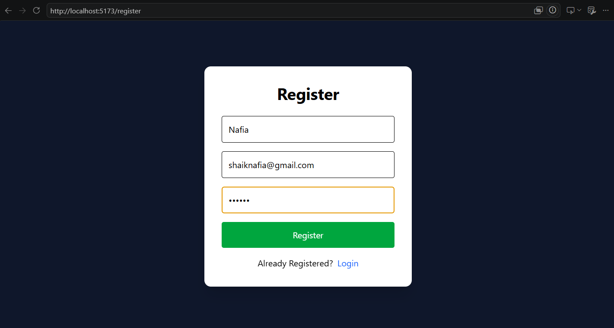
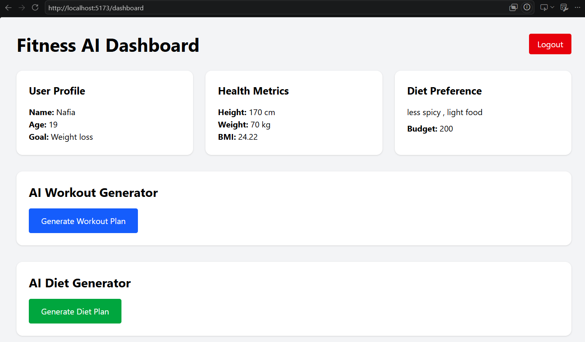
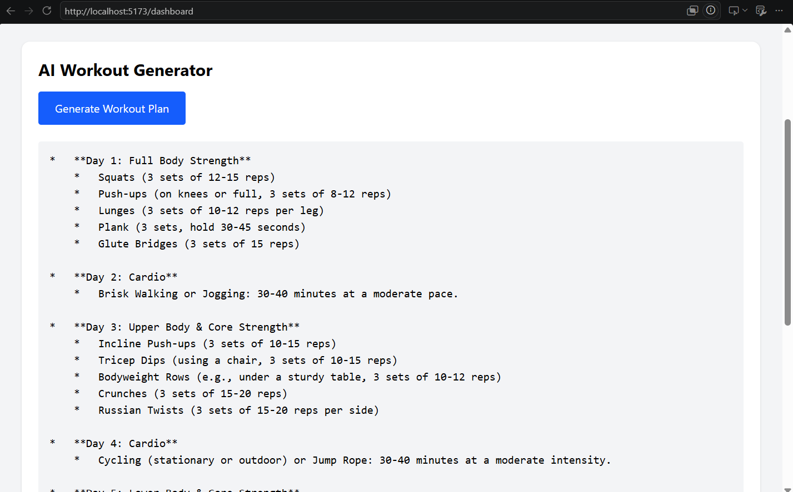

# AI-Powered Personalized Workout & Diet Planner

## Overview

AI-Powered Personalized Workout & Diet Planner is a full-stack web application that generates personalized workout and diet recommendations using Artificial Intelligence. The application analyzes user fitness data such as age, height, weight, fitness goals, food preferences, and budget to provide customized fitness and nutrition plans.

Google Gemini AI is integrated to generate intelligent and personalized recommendations for each user.

---

## Live Demo

### Frontend (Vercel)

https://fitness-ai-planner-one.vercel.app/

### Backend API (Render)

https://fitness-ai-planner.onrender.com

### GitHub Repository

https://github.com/SHAIKNAFIA/fitness-ai-planner

---

## Features

### User Authentication

* User Registration
* User Login
* Secure User Management

### Profile Management

* Age
* Gender
* Height
* Weight
* Fitness Goal
* Food Preference
* Budget

### Health Analysis

* Automatic BMI Calculation
* User Health Metrics Dashboard

### AI Workout Planner

* Personalized Workout Recommendations
* Generated using Google Gemini AI
* Based on User Profile and Fitness Goals

### AI Diet Planner

* Personalized Diet Recommendations
* Indian Diet Suggestions
* Budget-Friendly Meal Planning
* Generated using Google Gemini AI

### Dashboard

* User Profile Overview
* BMI Display
* Workout Plan Generator
* Diet Plan Generator
* Logout Functionality

---

## Technology Stack

### Frontend

* React.js
* Vite
* Axios
* CSS

### Backend

* Python
* Flask
* Flask-CORS
* Flask-SQLAlchemy

### Database

* SQLite

### Artificial Intelligence

* Google Gemini 2.5 Flash API

### Deployment

* Vercel (Frontend)
* Render (Backend)

### Version Control

* Git
* GitHub

---

## System Architecture

```text
User
   ↓
React Frontend
   ↓
Flask Backend
   ↓
SQLite Database
   ↓
Google Gemini AI
   ↓
Personalized Workout & Diet Plans
```

---

## Project Structure

```text
fitness-ai-planner/
│
├── backend/
│   ├── ai/
│   │   └── gemini_model.py
│   ├── config/
│   ├── database/
│   ├── models/
│   ├── routes/
│   ├── services/
│   ├── app.py
│   └── requirements.txt
│
├── frontend/
│   ├── public/
│   ├── src/
│   │   ├── pages/
│   │   ├── services/
│   │   ├── assets/
│   │   ├── App.jsx
│   │   └── main.jsx
│   ├── package.json
│   └── vite.config.js
│
├── screenshots/
├── README.md
└── .gitignore
```

---

## Installation

### Clone Repository

```bash
git clone https://github.com/SHAIKNAFIA/fitness-ai-planner.git
cd fitness-ai-planner
```

### Backend Setup

```bash
cd backend

pip install -r requirements.txt
```

Create a `.env` file:

```env
SECRET_KEY=your_secret_key
JWT_SECRET_KEY=your_jwt_secret
DATABASE_URL=sqlite:///fitness.db
GEMINI_API_KEY=your_gemini_api_key
```

Run Backend:

```bash
python app.py
```

Backend URL:

```text
http://127.0.0.1:5000
```

---

### Frontend Setup

```bash
cd frontend

npm install

npm run dev
```

Frontend URL:

```text
http://localhost:5173
```

---

## Workflow

1. User Registers an Account
2. User Logs In
3. User Completes Profile Information
4. System Calculates BMI Automatically
5. User Requests Workout Plan
6. Google Gemini AI Generates Personalized Workout Plan
7. User Requests Diet Plan
8. Google Gemini AI Generates Personalized Diet Plan
9. Results are Displayed on Dashboard

---

## Deployment

### Frontend

Hosted on Vercel

https://fitness-ai-planner-one.vercel.app/

### Backend

Hosted on Render

https://fitness-ai-planner.onrender.com

---

## Screenshots

### Login Page



### Registration Page



### Dashboard



### AI Workout Generator


### AI Diet Generator



---

## Future Enhancements

* Progress Tracking
* Calorie Tracking
* Workout History
* Diet History
* AI Fitness Chatbot
* Email Notifications
* Mobile Application
* Cloud Database Integration
* Wearable Device Integration
* Advanced Health Analytics

---

## Author

**Shaik Nafia**

B.Tech – Artificial Intelligence & Machine Learning

GitHub:
https://github.com/SHAIKNAFIA

LinkedIn:
(Add LinkedIn Profile Link)

---

## License

This project is developed for educational, learning, and portfolio purposes.
